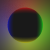
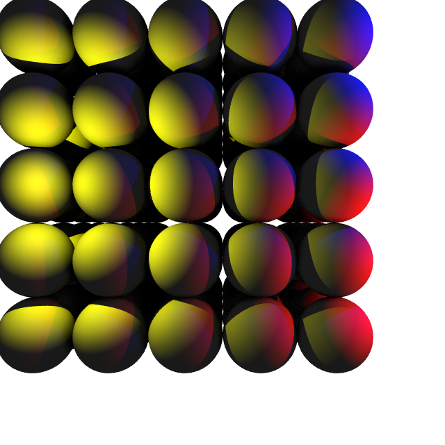

# Raytracer

This is a port of an simple raytracer that I wrote in c++/cuda for an university project to Rust in order to learn it.   
It reads a simple scene files that let you specify very simple geometries like spheres, planes and also to import wavefront obj file. (Some examples below)    
I also handled simple multithreading (with `rayon`) and model trasformations (that aren't present in the original implementation)  

## Table of contents

- [raytracer](#raytracer)
  - [Table of contents](#table-of-contents)
  - [Getting started](#getting-started)
  - [Arguments](#arguments)
  - [Examples](#examples)
  - [Future](#future)

## Getting started

In order to run the game, first clone the repository and enter the folder:

    git clone https://github.com/colobrodo/raytracer-rs.git
    cd raytracer

Then run the Rust compiler:

    cargo run

Voilà :tada:

## Arguments

Simple usage:    

    cargo run .\scene\simple_sphere.scene -o .\img\simple_sphere.bmp -s 1

You need a scene file as first argument (mandatory).
With the `-o` or `--output` option you can specify where to save the generated image.   
Using `--sample-rate` or `-s` you can choose how many rays use per pixel (20 by default)

## Examples

Here some of the generated images  

### Simple sphere

    size 1200 1200

    sphere (0, 0, -3.0) 1 white

    plane (0, 0, 1.0) -6 white

    # light sources
    light (-2, 0, -3) blue
    light (0, -2, -3) red
    light (2, 0, -3) green
    light (0, 2, -3) yellow

### Standford Bunny

    size 1200 1200

    model "./models/bunny_lp.obj" white > scale 0.4 > translate (0, 0, -7)

    # light sources
    light (0, 1, -2) blue
    light (0, 0, -1) green

### Suzanne
    size 1200 1200

    model "./models/monkey.obj" white > scale 0.7 > rotate (0, 1, 0) 3.14 > translate (0, 0, 4)

    # light sources
    light (1, 0, 3) blue
    light (-1, 0, 3) red

### Multiple Sphere

## Future

- I plan to use octree or grids to optimize the (now very slow) mesh rendering
- If I reach reasonable time with Octree/Grid optimization, try render a video rendering each frame and then using ffmpeg  
